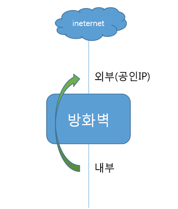

# Network

1. NAT 란 ?
2. 외부망과 내부망을 왜 나누는가
3. 파일시스템 하는 이유 
4. 파티셔닝 하는 이유
5. 논리 볼륨이란 ?

# NAT(Network Address Translation)

- NAT의 정의

    네트워크 주소(IP주소) 변환. 

    공인망(외부망)으로 나갈 때 내부망 그대로의 주소를 가져갈 수 없기 때문에 공인망의 주소로 바꿔나가는 것.

    내부망의 IP주소를 숨길 수 있기 때문에 보안에 도움

    

- NAT의 장점
    1. 공인IP 주소 절약
    2. 보안적 측면

        

# 내부망과 외부망

- 내부망

    일정 조직 내에서 인터넷이 아닌 내부 네트워크를 통해 PC끼리 자원을 공유하게 하거나 그룹웨어 등을 사용할 수 있게 하는 근거리 통신망(LAN, Local Area Network)

- 외부망

    일정 조직을 넘어 정보를 교환할 수 있는, 즉 인터넷(Internet)을 통한 네트워크

- 망분리를 하는 이유

    내부 네트워크망과 외부 네트워크망을 분리하여 외부로의 침입을 막고 내부 정보의 유출을 막기 위해서

# 파일 시스템

- 정의

    파일이나 자료를 쉽게 발견 및 접근할 수 있도록 보관 / 조직하는 체제

    ex) 하드 디스크 - 도서관

    파일 시스템 - 도서 검색대

    파일 - 책

- 종류
    - ext4 - 16TB까지만 지원하던 ext3과는 달리 더 큰 용량을 지원하며, 삭제된 파일 복구, 파일 시스템 속도가 훨씬 빨라진 파일시스템
    - xfs - 64bit 고성능 저널링 파일 시스템
- 사용하는 이유

    생성한 파티션에 데이터가 저장될 때 어떠한 방식으로 데이터를 저장하고 사용할지를 결정하는 파일 시스템을 생성해야 데이터를 저장할 수 있기 때문에 사용한다 !

# 파티션

- 구성
    - 리눅스 파티션은 주(Primary)파티션과 확장(Extended) 파티션, 논리(Logical) 파티션으로 구성

    ※ 확장 파티션은 데이터를 저장하기 위한 것이 아니라 실제 데이터가 저장되는 논리 파티션을 만들기 위한 툴

    ※ 확장 파티션은 파일 시스템 생성, 마운트 불가

    - 디스크 하나 당 주 파티션을 최대 4개까지 생성 가능

    - 4개 이상의 파티션이 필요할 경우에는 확장과 논리파티션이 필요하며,

    최대 12개까지 생성 가능

    ex)  [                주파티션             ]

           [        주파티션       ][        주파티션        ]

           [ 주파티션][주파티션][주파티션][주파티션 ]

- 사용하는 이유

    디스크를 추가하여 용량 증설을 할 수 있고, 파티션을 나누어 디스크를 효율적으로 사용할 수 있도록 설정하고, 안정적으로 사용할 수 있는 방법을 알 수 있음

# 논리볼륨

- 정의
    - 간단하게 여러개의 물리적 디스크(Physical Volume)를 논리적으로 묶어(Logical Volume Group) 큰 하나로 만든 후 논리적인 볼륨(Logical Volume)으로 나누어 사용한다는 의미
    - 물리적인 디스크를 묶어 논리적으로 나누어 사용하겠다는 의미로 해석

        —> 물리적인 공간 및 분할 제약에서 벗어날수 있음

- 사용하는 이유
    - 전통적인 디스크 파티셔닝은 할당된 사이즈 변경이 어렵기 때문에 확장성 유연성 어려움
    - 하드디스크를 파티션 대신 논리볼륨으로 볼륨을 구성하면 볼륨의 데이터를 유지한 상태에서 볼륨의 크기 변경과 스토리지 사이즈 부족시 사이즈 확장 가능하기 때문에 사용
